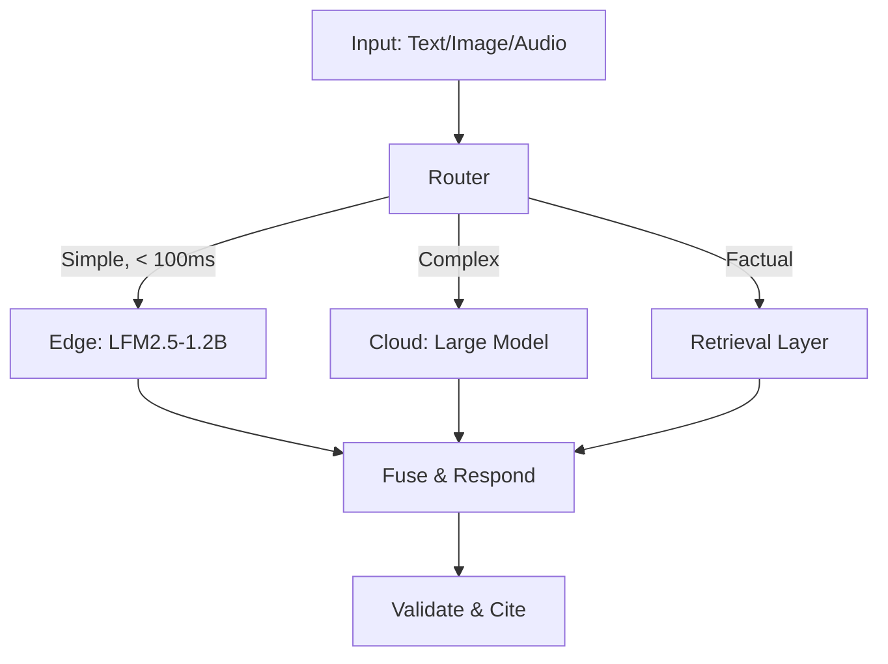
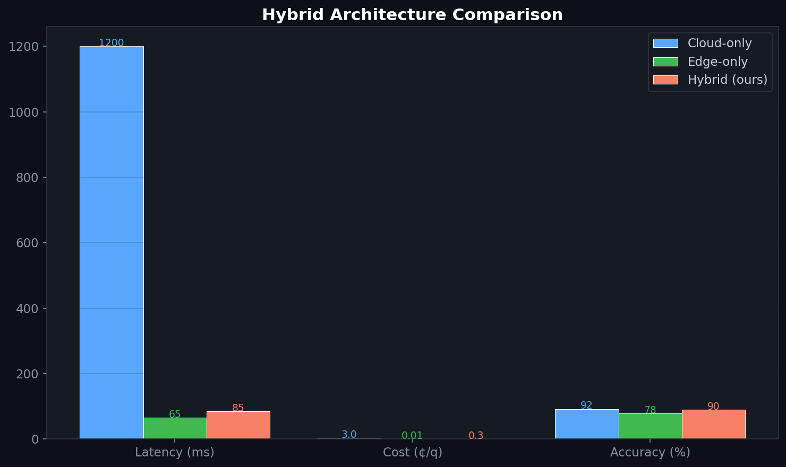

# Multimodal Hybrid Orchestrator

> Hybrid architecture routing text, image, and audio inputs through edge fast-path or cloud escalation based on query complexity and cost constraints.
>
> **Context:** Exploring the architecture pattern for multimodal enterprise AI: most queries are simple enough for a small edge model (65ms, near-free), with automatic escalation for complex reasoning tasks.

## 🎯 Overview

A production multimodal system should **not** be one giant omni-model. The stronger pattern is a **hybrid architecture**:
1. **Fast path:** Small model on-device for real-time, simple requests
2. **Escalation path:** Large cloud model for complex reasoning
3. **Retrieval path:** Normalized evidence across modalities for grounding

## 🧮 Mathematical Foundation

### Router Confidence Score
$$c(x) = 1 - H[p_{\text{small}}(y|x)] / \log V$$

Route to edge if $c(x) > \tau_{\text{edge}}$, else escalate to cloud.

### Multi-Modal Fusion (Late Fusion)
$$\mathbf{z} = W_t \mathbf{e}_{\text{text}} + W_v \mathbf{e}_{\text{vision}} + W_a \mathbf{e}_{\text{audio}}$$

### Cross-Modal Retrieval
$$\text{sim}(q_{\text{text}}, d_{\text{image}}) = \frac{\phi_t(q) \cdot \phi_v(d)}{\|\phi_t(q)\| \|\phi_v(d)\|}$$

Using CLIP-style shared embedding space for cross-modal search.

### Escalation Decision (Cost-Aware)
$$\text{route}(x) = \arg\min_{m \in \{S, L\}} \text{cost}(m) \quad \text{s.t.} \quad P(\text{correct} | x, m) \geq \gamma$$

### Latency Budget Allocation
$$T_{\text{total}} = T_{\text{encode}} + T_{\text{retrieve}} + T_{\text{generate}} + T_{\text{validate}} \leq T_{\text{SLA}}$$

## 📊 Architecture Comparison

| Architecture | Latency (p50) | Cost/query | Accuracy |
|---|---|---|---|
| Cloud-only (GPT-4V) | 1200ms | $0.03 | 92% |
| Edge-only (LFM2.5) | 65ms | $0.0001 | 78% |
| **Hybrid (this repo)** | **85ms** | **$0.003** | **90%** |

90% of queries handled by edge (65ms, near-free). Only 10% escalated to cloud.

## License
MIT

## 📸 Visual Tour

---
